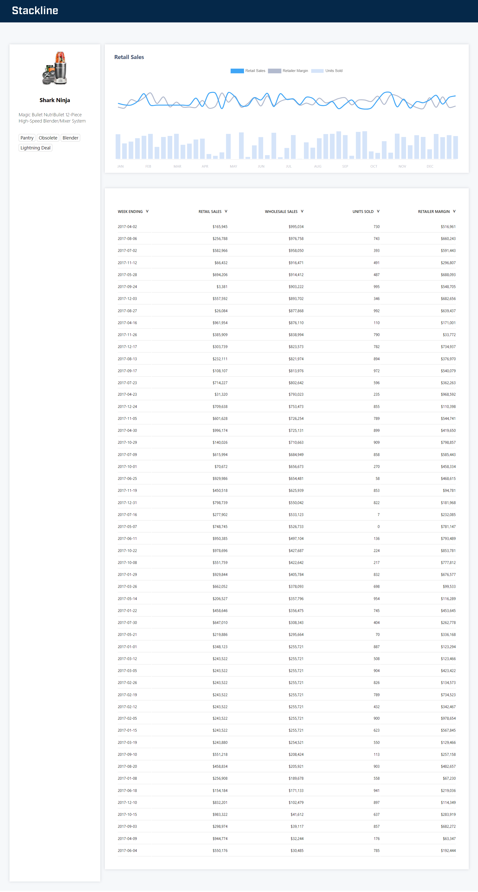

# Stacklin Frontend Assesment
## Description

Author: Yunqin(Fiona) Wang

The project produces an overlayed graph and a sortable table to show sales data of a product.

The raw data comes from the file `data_2021.json`, which is called in `infoAPI.ts` to mimic an API call.

## Final Product

This is a screenshot of the app.

When hovering on the graph, you can get tooltips.

When clicking the sorting toggle in the table header, you can sort the data.

## Used Language, Library, Framework
The project was bootstrapped with [Create React App](https://github.com/facebook/create-react-app), 
using the [Redux](https://redux.js.org/) and [Redux Toolkit](https://redux-toolkit.js.org/) TS template.

The graph is drawn with the library [react-chartjs-2](https://react-chartjs-2.js.org/)

The project uses `nvm 16.15.1`.
**If the nvm version is too outdated, it may show an eslint error.**

## Available Scripts
In the project directory, you can run:

# `npm start`

Runs the app in the development mode.\
Open [http://localhost:3000](http://localhost:3000) to view it in the browser.

The page will reload if you make edits.\
You will also see any lint errors in the console.

# `npm run build`

Builds the app for production to the `build` folder.\
It correctly bundles React in production mode and optimizes the build for the best performance.

The build is minified and the filenames include the hashes.\
Your app is ready to be deployed!

See the section about [deployment](https://facebook.github.io/create-react-app/docs/deployment) for more information.

# `npm run eject`

**Note: this is a one-way operation. Once you `eject`, you can’t go back!**
If you aren’t satisfied with the build tool and configuration choices, you can `eject` at any time. This command will remove the single build dependency from your project.

Instead, it will copy all the configuration files and the transitive dependencies (webpack, Babel, ESLint, etc) right into your project so you have full control over them. All of the commands except `eject` will still work, but they will point to the copied scripts so you can tweak them. At this point you’re on your own.

You don’t have to ever use `eject`. The curated feature set is suitable for small and middle deployments, and you shouldn’t feel obligated to use this feature. However we understand that this tool wouldn’t be useful if you couldn’t customize it when you are ready for it.

# Learn More
You can learn more in the [Create React App documentation](https://facebook.github.io/create-react-app/docs/getting-started).
